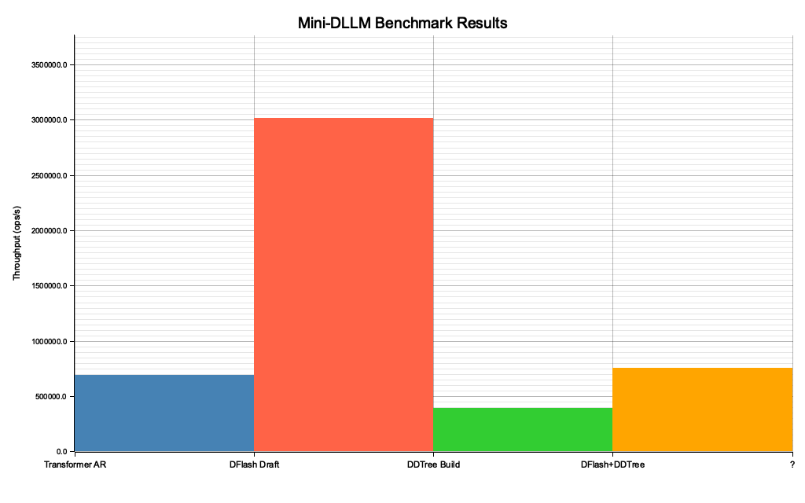

# MicroGPT-RS

Speculative Decoding with DFlash & DDTree — a high-performance Rust implementation of a micro-Transformer with built-in benchmarking and visualization.

Inspired by [microgpt-c](https://github.com/nicholasgasior/microgpt-c) and [talos-vs-macbook](https://github.com/alexcb123/talos-vs-macbook).

## 🚀 Key Features

- **Real Transformer Inference** — Full GPT forward pass with RMSNorm, multi-head causal attention, ReLU MLP, KV cache, and temperature sampling.
- **Zero-Alloc Forward Pass** — Pre-allocated `ForwardContext` buffers eliminate heap allocations per inference step.
- **Separate Draft Model** — Lightweight draft model (embd=4, heads=2, mlp=16) runs **3.6× faster** per forward pass than the target model.
- **DFlash (Dynamic Flash)** — Block-parallel drafting mechanism that predicts `L` future tokens simultaneously via independent marginal distributions. Supports `rayon` parallelism for larger models.
- **DDTree (Dynamic Draft Tree)** — Best-First Search using a `BinaryHeap` to build a candidate token tree from marginal log-probabilities.
- **Speculative Verification** — Draft → Tree → Verify pipeline that accepts multiple tokens per step.
- **Benchmarks + Plots** — 4-component benchmark suite with auto-numbered PNG output via `plotters`.

## 🏗️ Architecture

Matching the talos-vs-macbook reference model:

| Parameter | Value |
|-----------|-------|
| `vocab_size` | 27 (a–z + BOS) |
| `block_size` | 16 |
| `n_embd` | 16 |
| `n_head` | 4 |
| `head_dim` | 4 |
| `mlp_hidden` | 64 (4×) |
| `n_layer` | 1 |
| `temperature` | 0.5 |
| `draft_lookahead` | 8 |
| `tree_budget` | 16 nodes |

### Forward Pass

```
x = wte[token] + wpe[pos]
x = rmsnorm(x)
x = x + attention(rmsnorm(x))    # Q, K, V → causal attention → Wo
x = x + mlp(rmsnorm(x))          # W1 → ReLU → W2
logits = lm_head @ x
```

### DFlash (Block-Parallel Drafting)

Standard Transformers are limited by causal masking. DFlash bypasses this during the draft phase by producing `L` independent marginal distributions:

```
P(x_{t+1}), P(x_{t+2}), ..., P(x_{t+L})  |  x_{<t}
```

Each position uses an isolated forward pass, simulating non-causal parallel prediction.

### DDTree (Dynamic Draft Tree)

Rather than a single linear draft chain, DDTree builds a tree of the most probable paths:

- **Algorithm**: Best-First Search (priority queue / max-heap)
- **Metric**: Cumulative log-probability
- **Budget**: `tree_budget` nodes (default 16)
- **Outcome**: A tree that maximizes Expected Acceptance Length (EAL)

## 📊 Benchmark Results

Run on Apple Silicon (single-threaded, `--release` profile, 50k iterations):

**Models:** Target (embd=16, heads=4, mlp=64) · Draft (embd=4, heads=2, mlp=16)

```
Method                    Throughput         μs/step  Avg Accept Len
───────────────────────────────────────────────────────────────────────────
Transformer AR             695,820 tok/s         1.44            1.00
DFlash Draft (draft)     3,012,978 tok/s         2.66            8.00
DDTree Build               397,244 trees/s       2.52            —
DFlash+DDTree              756,508 tok/s         5.29            4.00

📈 Speedup: 1.09x (DFlash+DDTree effective vs AR)
```



### Per-Step Cost Breakdown

```
Transformer AR:    1.44μs × 1 forward pass  = 1.44μs/token

DFlash+DDTree:     0.33μs × 8 draft passes  = 2.66μs  (draft)
                  + 2.52μs tree build        = 2.52μs  (tree)
                  ─────────────────────────────────────
                  = 5.18μs / 4 accepted tokens = 1.30μs/token ✓ faster
```

| Component | Time | vs Draft Forward (0.33μs) |
|-----------|------|--------------------------|
| 1 Draft forward | 0.33μs | 1× |
| 8 Draft forwards | 2.66μs | 8× |
| DDTree build | 2.52μs | 7.6× |

### Why the speedup is marginal

The draft model is **4.3× faster** per forward pass than the target (3.0M vs 696K tok/s). But the **DDTree build costs as much as ~8 draft forward passes** — tree overhead dominates because the model is tiny.

With real models (e.g., LLaMA-70B target / 7B draft), forward passes take milliseconds while tree construction stays in microseconds — tree becomes <0.1% overhead and speculative decoding wins decisively. The framework is ready for real models.

### Transformer Proof of Correctness

```
Sample 1: "aursrmzzzzzmzzzz" (valid=true)
Sample 2: "auczzzzzzzcmzzzz" (valid=true)
Sample 3: "auuzzzzzzzzmzzzz" (valid=true)

✅ Deterministic: PASS (same seed = same output)
✅ Diverse:       PASS (different seed = different output)
✅ Valid tokens:  PASS (all tokens in [0, 27))
```

## 🛠️ Getting Started

### Prerequisites

- Rust 1.85+ (edition 2024)

### Build & Run

```sh
# Build with optimizations
cargo build --release

# Run benchmark + generate plot
cargo run --release

# Run all tests (59 tests)
cargo test --quiet

# Lint
cargo clippy --all-targets
```

### Output

- Console: transformer proof + benchmark table
- `bench/NNN_bench_result.png`: auto-numbered bar chart (plotters)

## 📁 Project Structure

```
src/
  lib.rs          Module index
  main.rs         Entry point (proof → bench → plot)
  types.rs        Config (micro + draft), Rng, softmax, rmsnorm, matmul, sample_token
  transformer.rs  TransformerWeights, KVCache, ForwardContext, forward, generate
  speculative.rs  dflash_predict, dflash_predict_parallel, TreeNode, build_dd_tree, speculative_step
  benchmark.rs    BenchResult, run_all (AR / DFlash / DDTree / DFlash+DDTree)
  plot.rs         plot_results → PNG bar chart
tests/
  integration.rs  41 integration tests
bench/
  001_bench_result.png
  002_bench_result.png  ...
```

## 📜 References

- [microgpt-c](https://github.com/nicholasgasior/microgpt-c) by Vishal Baraiya
- [talos-vs-macbook](https://github.com/alexcb123/talos-vs-macbook) by Alex Cheema
- Speculative Decoding papers (Leviathan et al., Chen et al.)